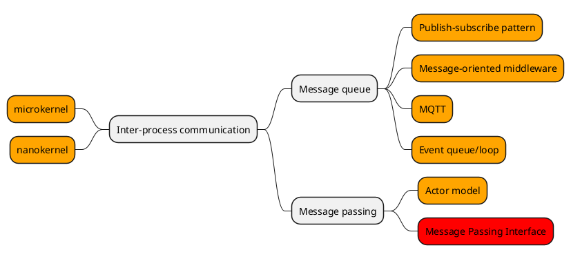

# Message passing

## Landscape

Legend:
1. Red: not of interest
1. Orage: to do

Term | Description
--- | ---
Inter-Process Communication (IPC) | Mechanism to share data between processes, various methods are available.
Message queue (Mailbox) | An IPC component where processes can read/write to a queue without being aware of each other.
Message passing | An IPC method/technique to invoke behaviour in another process (may be an actor) via a message.
Message Passing Interface | Specification for high performace parallel computing.

Message queue -> use in GUIs?

Todo:
* [event queue](https://gameprogrammingpatterns.com/event-queue.html)
* microkernel
* nanokernel
* Publish–subscribe pattern
* Message-oriented middleware
* MQTT
* Message passing
* actor model

## Message passing

Synchronous message passing: sending process waits for receiver to complete processing the message.
Asynchronous message passing: sending and receiving processes are decoupled via a message queue.

**Asynchronous message passing**
Advantages: not waiting for each other
Disadvantages: queue can be full (drop new ones, wait for space?)

## Actor model

### Implementations

* [QP/C++](https://www.state-machine.com/products/qp)
* [SObjectizer](https://github.com/Stiffstream/sobjectizer)
* [C++ Actor Framework](https://www.actor-framework.org/)
* [rotor](https://github.com/basiliscos/cpp-rotor)
* [actor-zeta](https://github.com/duckstax/actor-zeta)

