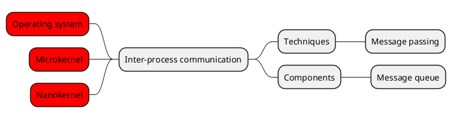

# Message passing

## Landscape

++ Message queue
+++ Publish–subscribe pattern
+++[#Red] Message-oriented middleware
+++[#Orange] MQTT
++ Event-driven messaging
+++[#Red] Event-driven architecture
++ Message passing
+++[#Orange] Actor model
+++[#Red] Message Passing Interface

Legend:
1. Red: not of interest
1. Orage: to do

Term | Description
--- | ---
Inter-process communication (IPC) | Mechanism to share data between processes, various methods are available.
Message passing | An IPC method/technique to invoke behaviour in another process via a message.
Message queue (mailbox) | An IPC component where processes can write/read messages to/from without being aware of each other.

### Inter-process communication

Inter-process communication (IPC) is a mechanism to communicate between processes. There are various approaches for implementing a IPC mechanism. Examples include: sockers, signals, message passing, and shared memory.

### Message passing

Messages passing is used to trigger, from one proceess, behaviour in another process via a communication link. 

**Direct vs indirect**
*Direct*: the sender sends a message to a specific receiver. Implies a one to one link between two processes.
*Indirect*: the sender places a message into a mailbox/queue and one or more receivers may retrieve it.

**Synchronous vs Asynchronous**
*Synchronous*: the sending process waits for receiving process to complete processing the message.
*Asynchronous*: sending and receiving processes do not wait for each other, they are decoupled via a message queue.

### Message queue / mailbox

## Take aways

* Message passing
* Indirect
  * multiple receivers, all receive the same message
* Asynchronous

## Sources

1. [Inter-process communication](https://en.wikipedia.org/wiki/Inter-process_communication)
1. [Inter Process Communication (IPC)](https://www.geeksforgeeks.org/inter-process-communication-ipc/)

# Scratchpad 

Term | Description
--- | ---
Message Passing Interface | Specification for high performace parallel computing.
Publish–subscribe pattern | 
microkernel | 
nanokernel |
Message-oriented middleware | 
MQTT | 
Actor model | 
Event-driven messaging | An event messager is used to distribute posted events to intereested subscribers.
Event-driven architecture | Detection and notification of state changes, which may use messages to do so.

Message queue -> use in GUIs?

Todo:
* [event queue](https://gameprogrammingpatterns.com/event-queue.html)
* microkernel
* nanokernel
* Publish–subscribe pattern
* Message-oriented middleware
* MQTT
* Message passing
* actor model
* Event-driven messaging vs asynchronous message passing

## Message passing

**Asynchronous message passing**
Advantages: not waiting for each other
Disadvantages: queue can be full (drop new ones, wait for space?)

Advantages: decoupled procsses (asynchronous message passing), routing/broadcasting, manipulation (filters, ...)
Disadvantages: additional components (queue, broker, ...), application needs to fit async behaviour

## Actor model

### Implementations

* [QP/C++](https://www.state-machine.com/products/qp)
* [SObjectizer](https://github.com/Stiffstream/sobjectizer)
* [C++ Actor Framework](https://www.actor-framework.org/)
* [rotor](https://github.com/basiliscos/cpp-rotor)
* [actor-zeta](https://github.com/duckstax/actor-zeta)

## Publish–subscribe pattern

Related to the `message queue`, publishers publish specific messages (classes/types) without knowing who receives it. Samilarly, subscribers subscribe on specific messages (classes/types) and receive messages without knowing who published the messages.

Advantages:
* filtering; subscribers only receive messages they are subscribed to
* decoupled publishers and subscribers

Disadvantages:
* delivery uncertainty (are subscribers listening?, are messages transmitted?)
